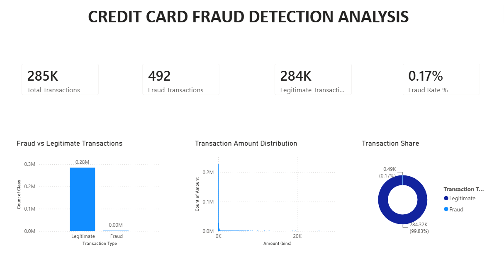
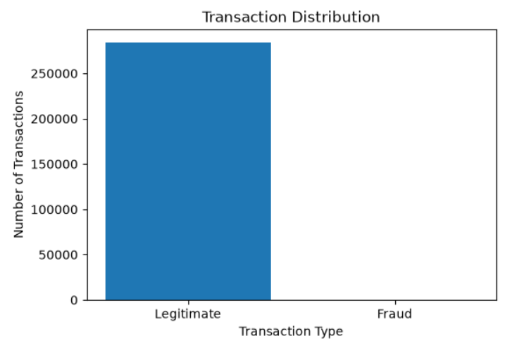
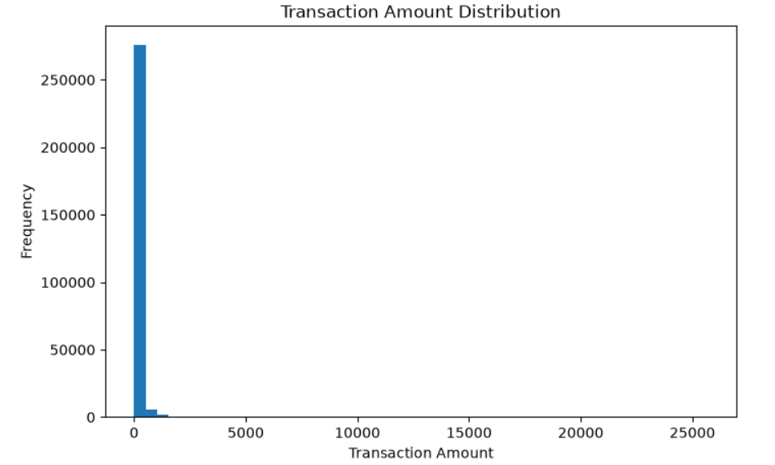
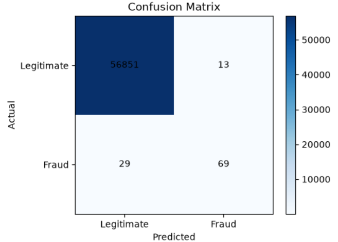
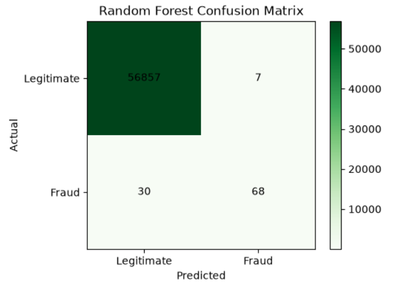

# 💳 Credit Card Fraud Detection

A Machine Learning project that detects fraudulent credit card transactions using Python, Scikit-learn, and Power BI. This project includes data preprocessing, exploratory data analysis, model training, model evaluation, and an interactive Power BI dashboard for transaction analysis.

---

# Dashboard Overview



---

# Project Overview

Credit card fraud detection is an important application of machine learning in the financial industry. Since fraudulent transactions are extremely rare compared to legitimate ones, this project focuses on identifying fraudulent transactions from a highly imbalanced dataset.

The project includes:

- Data preprocessing and cleaning
- Exploratory Data Analysis (EDA)
- Feature scaling
- Logistic Regression model
- Random Forest model
- Model comparison
- Power BI dashboard
- Fraud prediction model export

---

# Dashboard Features

### KPI Cards
- Total Transactions
- Fraud Transactions
- Legitimate Transactions
- Fraud Rate (%)

### Visualizations
- Fraud vs Legitimate Transactions
- Transaction Amount Distribution
- Transaction Share (Donut Chart)

---

# Machine Learning Models

### Logistic Regression
- Accuracy: **99.93%**
- Precision: **84.15%**
- Recall: **70.48%**
- F1 Score: **76.67%**
- ROC-AUC: **85.19%**

### Random Forest
- Accuracy: **99.94%**
- Precision: **90.67%**
- Recall: **69.39%**
- F1 Score: **78.61%**
- ROC-AUC: **84.69%**

**Selected Model:** Random Forest Classifier

---

# Project Structure

```
Credit Card Fraud Detection
│
├── Dashboard
│   └── credit_card_fraud_detection_dashboard.pdf
│
├── Models
│   └── fraud_detection_model.pkl
│
├── Python
│   └── credit_card_fraud_detection.ipynb
│
├── Screenshots
│   ├── dashboard_overview.png
│   ├── transaction_distribution.png
│   ├── amount_distribution.png
│   ├── confusion_matrix_logistic.png
│   └── confusion_matrix_random_forest.png
│
└── README.md
```

---

# Technologies Used

- Python
- Pandas
- NumPy
- Matplotlib
- Scikit-learn
- Joblib
- Jupyter Notebook
- Power BI

---

# Key Insights

- The dataset is highly imbalanced, with only **0.17%** fraudulent transactions.
- Feature scaling improved model performance.
- Logistic Regression provided a strong baseline model.
- Random Forest achieved better precision and overall F1-score, making it the preferred model.
- The Power BI dashboard provides an interactive overview of transaction patterns and fraud statistics.

---

# Screenshots

## Transaction Distribution



---

## Transaction Amount Distribution



---

## Logistic Regression Confusion Matrix



---

## Random Forest Confusion Matrix



---

# Conclusion

This project demonstrates an end-to-end machine learning workflow for credit card fraud detection, from data preprocessing and exploratory analysis to model training, evaluation, and visualization. By combining Python-based machine learning with a Power BI dashboard, the project highlights both predictive analytics and business intelligence skills, making it a strong addition to a Data Analytics or Machine Learning portfolio.
